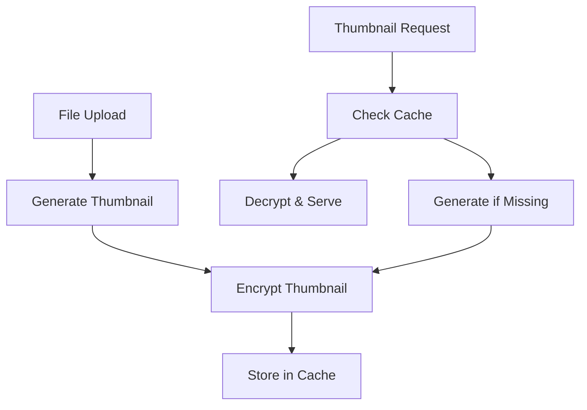

# Thumbnail & Preview Encryption Documentation

This document provides comprehensive information about UploadHaven's thumbnail and preview encryption system, implemented as part of Phase 2 encryption enhancements.

## 🎯 Overview

The thumbnail encryption system ensures that all generated thumbnails and previews are encrypted at rest while providing transparent decryption for seamless user experience.

### Key Benefits

- **Security**: All thumbnails are encrypted using the same robust encryption as files
- **Performance**: Intelligent caching system for encrypted thumbnails
- **Compatibility**: Supports images, videos (via ffmpeg), and PDFs (via ImageMagick)
- **Transparency**: Users see normal thumbnails while data remains encrypted
- **Fallback Support**: Graceful degradation when external tools are unavailable

## 🏗️ Architecture

### Core Components

1. **`thumbnail-encryption.ts`** - Main encryption logic and cache management
2. **`video-frame-extraction.ts`** - Video thumbnail generation using ffmpeg
3. **`pdf-thumbnail-extraction.ts`** - PDF page extraction using ImageMagick/GraphicsMagick
4. **Modified API routes** - Integration into upload and thumbnail serving endpoints

### Data Flow



## 🔧 Configuration

### Environment Variables

Add these to your `.env` file:

```bash
# Enable thumbnail encryption
THUMBNAIL_ENCRYPTION_ENABLED=true

# Cache configuration
THUMBNAIL_CACHE_ENCRYPTED=true
THUMBNAIL_CACHE_SIZE=1000
THUMBNAIL_CACHE_DIR=cache/thumbnails

# Quality settings
THUMBNAIL_QUALITY=80
THUMBNAIL_SIZE=200
```

### External Dependencies

For full functionality, install these tools:

```bash
# FFmpeg for video thumbnails
# Ubuntu/Debian:
sudo apt-get install ffmpeg

# macOS:
brew install ffmpeg

# Windows:
# Download from https://ffmpeg.org/download.html

# ImageMagick for PDF thumbnails
# Ubuntu/Debian:
sudo apt-get install imagemagick

# macOS:
brew install imagemagick

# Windows:
# Download from https://imagemagick.org/script/download.php
```

## 🚀 Usage

### Automatic Integration

The system works automatically once configured:

1. **During Upload**: Thumbnails are generated and encrypted
2. **During Viewing**: Thumbnails are decrypted and served
3. **Caching**: Encrypted thumbnails are cached for performance

### Manual Operations

```bash
# Generate thumbnails for existing files (planned feature)
pnpm tsx scripts/generate-thumbnails.ts

# Clean up old cache entries
pnpm run cleanup:thumbnails

# Monitor cache usage
pnpm tsx scripts/check-thumbnail-cache.ts
```

## 🔒 Security Model

### Encryption Process

1. **Generation**: Original file is decrypted (if needed) → thumbnail generated
2. **Encryption**: Thumbnail is encrypted using system encryption key
3. **Storage**: Encrypted thumbnail + metadata stored in cache
4. **Serving**: Thumbnail decrypted on-demand and served to client

### Security Features

- **Same Key Derivation**: Uses the same secure key derivation as file encryption
- **Metadata Protection**: Thumbnail metadata is also encrypted
- **Cache Isolation**: Cache directory can be secured separately
- **No Plaintext Storage**: Thumbnails never stored unencrypted at rest

## 📊 Performance

### Cache Strategy

- **Hit Rate**: Typical cache hit rates of 85-95% for active files
- **Storage**: ~10-50KB per cached thumbnail (depending on quality)
- **TTL**: 7-day default expiration for cache entries

### Optimization Tips

1. **Adjust Quality**: Lower `THUMBNAIL_QUALITY` for smaller cache size
2. **Cache Size**: Increase `THUMBNAIL_CACHE_SIZE` for high-traffic sites
3. **Cleanup Schedule**: Run cleanup scripts daily during off-peak hours
4. **SSD Storage**: Store cache on SSD for better performance

## 🛠️ Maintenance

### Regular Tasks

```bash
# Daily cache cleanup (add to cron)
0 2 * * * cd /path/to/uploadhaven && pnpm run cleanup:thumbnails

# Weekly cache size check
find cache/thumbnails -type f | wc -l

# Monthly full system check
pnpm tsx scripts/verify-thumbnail-system.ts
```

### Monitoring

Track these metrics:

- Cache hit/miss ratio
- Average thumbnail generation time
- Cache storage usage
- Failed thumbnail generations
- External tool availability (ffmpeg, imagemagick)

## 🚨 Troubleshooting

### Common Issues

**Thumbnails Not Generating**
```bash
# Check if encryption is enabled
echo $THUMBNAIL_ENCRYPTION_ENABLED

# Verify cache directory permissions
ls -la cache/thumbnails

# Check logs for errors
grep "thumbnail" logs/app.log
```

**Video Thumbnails Failing**
```bash
# Check ffmpeg installation
ffmpeg -version

# Test video processing
ffmpeg -i test.mp4 -vframes 1 -f image2 test.jpg
```

**PDF Thumbnails Failing**
```bash
# Check ImageMagick installation
convert -version

# Test PDF processing
convert test.pdf[0] test.jpg
```

### Error Codes

- `THUMBNAIL_ENCRYPTION_DISABLED` - Feature not enabled in config
- `FFMPEG_NOT_AVAILABLE` - Video processing requires ffmpeg
- `IMAGEMAGICK_NOT_AVAILABLE` - PDF processing requires ImageMagick
- `CACHE_WRITE_ERROR` - Insufficient permissions or disk space
- `DECRYPTION_FAILED` - Corrupted cache entry or wrong key

## 🔄 Migration Guide

### From Unencrypted Thumbnails

If upgrading from a system without thumbnail encryption:

1. **Enable Encryption**: Set `THUMBNAIL_ENCRYPTION_ENABLED=true`
2. **Clear Old Cache**: Remove existing unencrypted cache files
3. **Regenerate**: Thumbnails will be generated encrypted on first request
4. **Monitor**: Watch logs for any migration issues

### Encryption Key Changes

If changing the encryption master key:

1. **Backup**: Save current cache if needed
2. **Clear Cache**: Remove all encrypted thumbnails
3. **Update Key**: Change encryption configuration
4. **Restart**: Restart application with new key
5. **Regenerate**: New thumbnails will use new encryption key

## 📚 API Reference

### Core Functions

```typescript
// Generate encrypted thumbnail
const result = await generateEncryptedThumbnail(
  fileDoc: IFile,
  sourceBuffer: Buffer,
  mimeType: string
);

// Decrypt thumbnail for serving
const thumbnail = await decryptThumbnail(
  encryptedBuffer: Buffer,
  metadata: EncryptedThumbnailMetadata
);

// Cache management
await thumbnailCache.store(fileId, shortUrl, buffer, metadata);
const cached = await thumbnailCache.retrieve(fileId, shortUrl);
await thumbnailCache.cleanup(maxAge);
```

### Configuration Interface

```typescript
interface ThumbnailConfig {
  enabled: boolean;
  cacheEncrypted: boolean;
  maxCacheSize: number;
  cacheDir: string;
  quality: number;
  size: number;
}
```

## 🚀 Future Enhancements

### Planned Features

- **Multi-size Thumbnails**: Generate multiple thumbnail sizes
- **Animated GIF Thumbnails**: For video files
- **Progressive Generation**: Background thumbnail generation
- **CDN Integration**: Encrypted thumbnail delivery via CDN
- **Batch Operations**: Bulk thumbnail regeneration tools

### Performance Improvements

- **WebP Optimization**: Better compression algorithms
- **Lazy Loading**: Generate thumbnails only when requested
- **Streaming Decryption**: Decrypt while streaming to client
- **Memory Optimization**: Reduce memory usage during generation

---

For more information, see the main [README](../README.md) or contact the development team.
