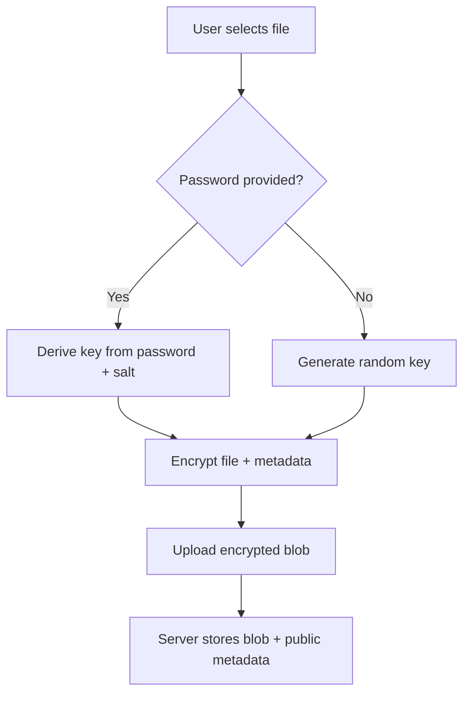

# Zero-Knowledge File Encryption

## Overview

UploadHaven's Zero-Knowledge (ZK) encryption system provides true end-to-end encryption where files
are encrypted entirely on the client-side before upload. The server acts as "dumb storage" and never
has access to decryption keys or plaintext content.

## Key Features

- **Client-side AES-256-GCM encryption** using Web Crypto API
- **PBKDF2 key derivation** with unique salts for password-based encryption
- **Encrypted file metadata** (filename, mimetype) within the encrypted blob
- **Share links with embedded keys** or password-derived keys
- **Server acts as dumb storage** - cannot decrypt or preview files
- **No key escrow** - lost keys/passwords mean lost data (by design)

## Architecture

### 1. Encryption Process (Client-Side Only)



### 2. Key Management

#### Random Key Encryption (No Password)

```typescript
// 1. Generate random 256-bit AES key
const key = await generateRandomKey();

// 2. Encrypt file with key
const result = await encryptFileZK(file);

// 3. Embed key in share link
const shareLink = generateZKShareLink(baseUrl, shortUrl, result.keyData);
// Result: https://example.com/s/abc123#key=base64EncodedKey
```

#### Password-Based Encryption

```typescript
// 1. Derive key from password using PBKDF2
const result = await encryptFileZK(file, userPassword);

// 2. Create password-protected share link
const shareLink = generateZKShareLink(baseUrl, shortUrl, result.keyData);
// Result: https://example.com/s/abc123#password
```

### 3. Server Storage

The server stores only:

- **Encrypted blob** (opaque binary data)
- **Public metadata**: algorithm, IV, salt, iterations, size, timestamp
- **Access controls**: password protection, expiration, download limits
- **No sensitive data**: filename, mimetype, or decryption keys

```typescript
// Database schema for ZK files
interface IFile {
  // ... standard fields ...
  isZeroKnowledge: boolean;
  zkMetadata: {
    algorithm: string; // 'AES-GCM'
    iv: string; // Base64 encoded IV
    salt: string; // Base64 encoded salt
    iterations: number; // PBKDF2 iterations (100,000)
    encryptedSize: number; // Size of encrypted blob
    uploadTimestamp: number;
    keyHint: 'password' | 'embedded'; // UI hint
  };
}
```

## Implementation Details

### Client-Side Encryption

**File Structure Inside Encrypted Blob:**

```
[4 bytes: metadata length][JSON metadata][file content]
```

**Metadata Structure:**

```typescript
interface ZKFileMetadata {
  filename: string; // Original filename (encrypted)
  mimetype: string; // Original MIME type (encrypted)
  size: number; // Original file size (encrypted)
  timestamp: number; // Upload timestamp (encrypted)
}
```

**Encryption Process:**

1. Generate salt (32 bytes) and IV (12 bytes)
2. Derive/generate AES-256-GCM key
3. Prepare metadata JSON
4. Combine metadata length + metadata + file content
5. Encrypt combined payload
6. Return encrypted blob + public metadata

### Share Link Generation

#### For Random Keys (No Password)

```
https://example.com/s/{shortUrl}#key={base64Key}
```

#### For Password-Derived Keys

```
https://example.com/s/{shortUrl}#password
```

### Decryption Process

```typescript
// 1. Parse share link
const linkData = parseZKShareLink(shareLink);

// 2. Download encrypted blob from server
const response = await fetch(`/api/download/${linkData.shortUrl}`);
const encryptedBlob = await response.arrayBuffer();

// 3. Decrypt with key or password
let decryptedFile;
if (linkData.key) {
  // Use embedded key
  decryptedFile = await decryptFileZK(encryptedPackage, linkData.key, false);
} else if (linkData.password) {
  // Use user-provided password
  const password = prompt('Enter password:');
  decryptedFile = await decryptFileZK(encryptedPackage, password, true);
}

// 4. Create downloadable blob
const blob = new Blob([decryptedFile.file], {
  type: decryptedFile.metadata.mimetype,
});
```

## API Endpoints

### Upload API: `/api/zk-upload`

**Request:**

```typescript
{
  encryptedData: string;        // Base64 encoded encrypted blob
  publicMetadata: {
    size: number;               // Encrypted blob size
    algorithm: string;          // 'AES-GCM'
    iv: string;                // Base64 IV
    salt: string;              // Base64 salt
    iterations: number;        // PBKDF2 iterations
    uploadTimestamp: number;
  };
  keyData: {
    key?: string;              // Base64 key (if not password-derived)
    salt: string;              // Base64 salt
    isPasswordDerived: boolean;
  };
  userOptions: {
    password?: string;         // Optional file access password
    expiration: string;        // '1h', '24h', '7d', '30d', 'never'
  };
}
```

**Response:**

```typescript
{
  success: true;
  url: string;                 // Share URL
  isZeroKnowledge: true;
  keyType: 'password' | 'embedded';
  keyData?: {                  // Only for embedded keys
    key: string;
    salt: string;
  };
}
```

### Download API: `/api/download/{shortUrl}`

**ZK File Response Headers:**

```
Content-Type: application/octet-stream
X-ZK-Encrypted: true
X-ZK-Algorithm: AES-GCM
X-ZK-IV: base64IV
X-ZK-Salt: base64Salt
X-ZK-Iterations: 100000
X-ZK-Key-Hint: password|embedded
```

## Security Considerations

### ✅ Security Benefits

1. **True Zero-Knowledge**: Server cannot decrypt files under any circumstances
2. **Forward Secrecy**: Random keys are unique per file
3. **Strong Encryption**: AES-256-GCM with authenticated encryption
4. **Salt Protection**: PBKDF2 with unique salts prevents rainbow table attacks
5. **Metadata Protection**: Filenames and types are encrypted

### ⚠️ Security Trade-offs

1. **Key Loss = Data Loss**: No key recovery mechanism exists
2. **Client Vulnerability**: Malicious JS could steal keys before encryption
3. **Browser Security**: Relies on Web Crypto API implementation
4. **Link Security**: Embedded keys in URLs can leak through logs/referrers

### 🔒 Best Practices

1. **Use HTTPS**: Protect keys in transit
2. **Secure Key Sharing**: Share links through secure channels only
3. **Key Rotation**: Use unique keys per file (automatic)
4. **Password Strength**: Enforce strong passwords for password-based encryption
5. **Browser Security**: Keep browsers updated

## Client-Side Integration

### Basic Upload

```typescript
import { encryptFileZK, generateZKShareLink } from '@/lib/encryption/zero-knowledge';

async function uploadFileZK(file: File, password?: string) {
  // 1. Encrypt file client-side
  const encrypted = await encryptFileZK(file, password);

  // 2. Prepare upload data
  const uploadData = {
    encryptedData: arrayBufferToBase64(encrypted.encryptedPackage.encryptedData),
    publicMetadata: encrypted.encryptedPackage.publicMetadata,
    keyData: encrypted.keyData,
    userOptions: {
      expiration: '24h',
    },
  };

  // 3. Upload to server
  const response = await fetch('/api/zk-upload', {
    method: 'POST',
    headers: { 'Content-Type': 'application/json' },
    body: JSON.stringify(uploadData),
  });

  const result = await response.json();

  // 4. Generate final share link
  const shareLink = generateZKShareLink(window.location.origin, result.url, encrypted.keyData);

  return shareLink;
}
```

### Basic Download

```typescript
import { decryptFileZK, parseZKShareLink } from '@/lib/encryption/zero-knowledge';

async function downloadFileZK(shareUrl: string, password?: string) {
  // 1. Parse share link
  const linkData = parseZKShareLink(shareUrl);

  // 2. Download encrypted blob
  const response = await fetch(`/api/download/${linkData.shortUrl}`);
  if (!response.ok) throw new Error('Failed to download file');

  const encryptedData = await response.arrayBuffer();
  const headers = Object.fromEntries(response.headers.entries());

  // 3. Reconstruct encrypted package
  const encryptedPackage = {
    encryptedData,
    publicMetadata: {
      size: encryptedData.byteLength,
      algorithm: headers['x-zk-algorithm'],
      iv: headers['x-zk-iv'],
      salt: headers['x-zk-salt'],
      iterations: parseInt(headers['x-zk-iterations']),
      uploadTimestamp: Date.now(), // Not critical for decryption
    },
  };

  // 4. Decrypt file
  let decrypted;
  if (linkData.key) {
    decrypted = await decryptFileZK(encryptedPackage, linkData.key, false);
  } else if (linkData.password && password) {
    decrypted = await decryptFileZK(encryptedPackage, password, true);
  } else {
    throw new Error('Missing decryption key or password');
  }

  // 5. Create downloadable blob
  const blob = new Blob([decrypted.file], {
    type: decrypted.metadata.mimetype,
  });

  return {
    blob,
    filename: decrypted.metadata.filename,
    mimetype: decrypted.metadata.mimetype,
  };
}
```

## Migration Strategy

The ZK encryption system coexists with the existing server-side encryption:

1. **Legacy files** (`isZeroKnowledge: false`) use server-side decryption
2. **New ZK files** (`isZeroKnowledge: true`) use client-side decryption
3. **APIs detect** the encryption type and handle accordingly
4. **UI components** can support both types transparently

## Browser Compatibility

Requires modern browsers with Web Crypto API support:

- Chrome 37+
- Firefox 34+
- Safari 7+
- Edge 12+

Compatibility is checked automatically:

```typescript
const compat = checkBrowserCompatibility();
if (!compat.supported) {
  throw new Error(`Browser not supported: ${compat.missingFeatures.join(', ')}`);
}
```

## Performance Considerations

- **Encryption overhead**: ~200 bytes + 16-byte GCM tag
- **Memory usage**: File content loaded into memory during encryption/decryption
- **CPU usage**: AES-256-GCM is hardware-accelerated on modern devices
- **PBKDF2 iterations**: 100,000 iterations (adjustable) for password-based keys

## Testing

```bash
# Test encryption/decryption utilities
npm test src/lib/encryption/zero-knowledge.test.ts

# Test ZK upload API
npm test src/app/api/zk-upload/route.test.ts

# Test ZK download flow
npm test src/components/zk-upload.test.tsx
```

## Conclusion

The Zero-Knowledge encryption system provides the highest level of privacy and security for uploaded
files. While it requires careful implementation and user education about key management, it ensures
that UploadHaven cannot access user data under any circumstances, making it suitable for sensitive
file sharing scenarios.
